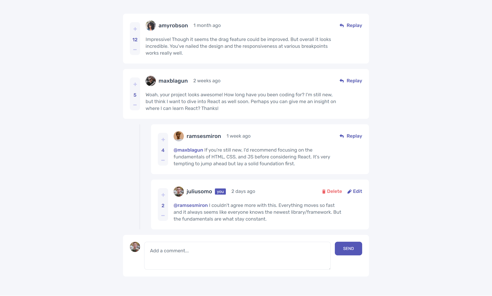
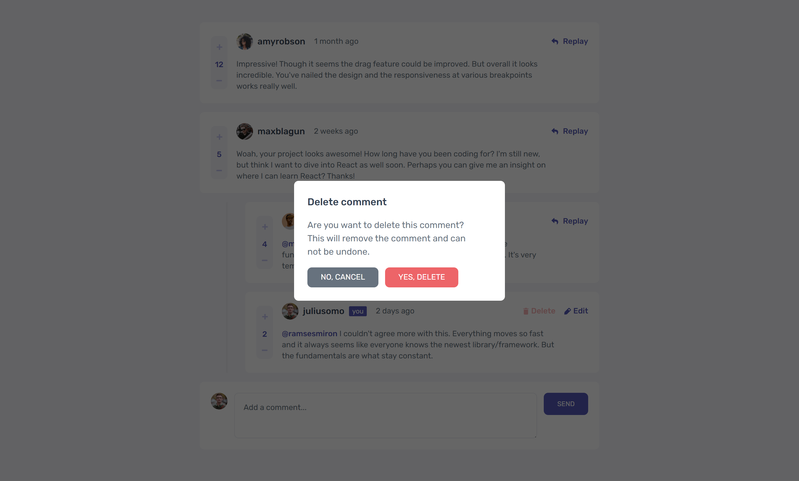
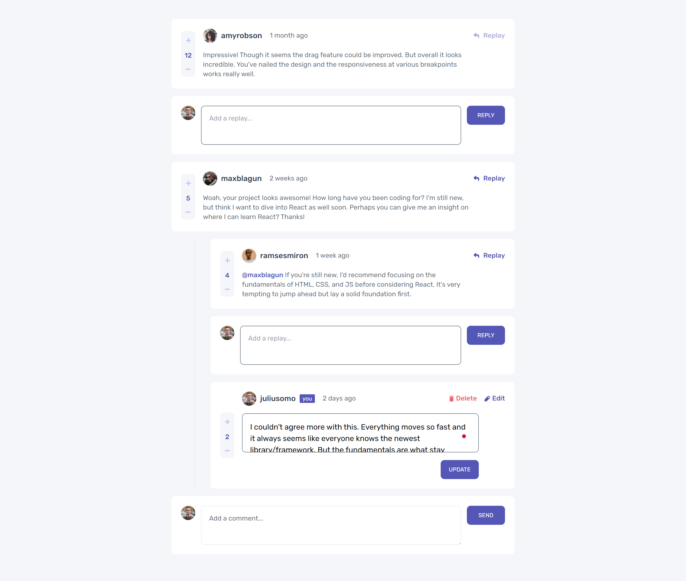
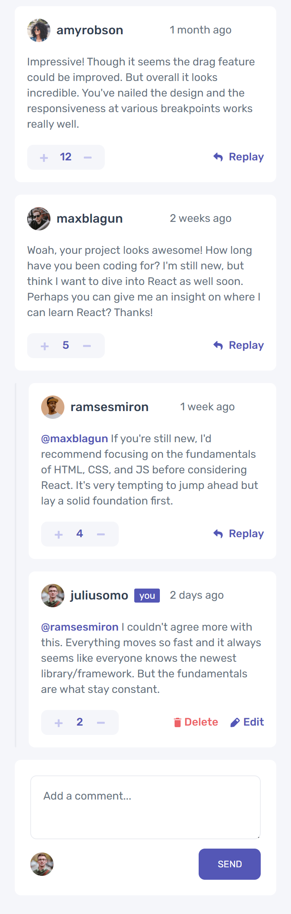
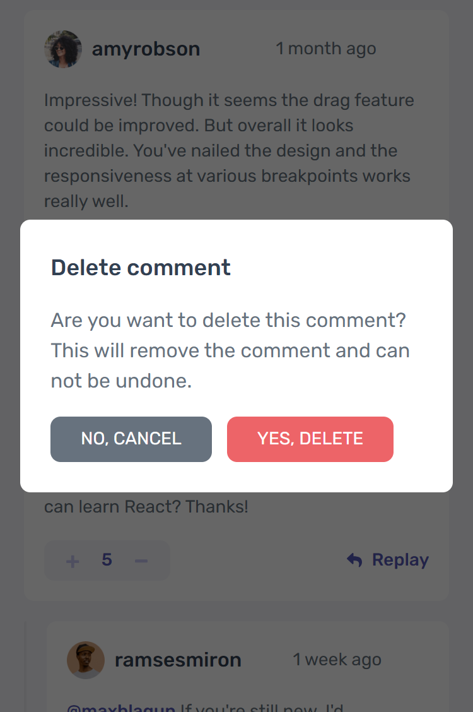

# Frontend Mentor - Interactive comments section solution

This is a solution to the [Interactive comments section challenge on Frontend Mentor](https://www.frontendmentor.io/challenges/interactive-comments-section-iG1RugEG9). Frontend Mentor challenges help you improve your coding skills by building realistic projects. 

## Table of contents

- [Overview](#overview)
  - [The challenge](#the-challenge)
  - [Links](#links)
- [My process](#my-process)
  - [Built with](#built-with)
  - [What I learned](#what-i-learned)
- [Author](#author)
- [Screenshot](#screenshot)

## Overview

### The challenge

Users should be able to:

- View the optimal layout for the app depending on their device's screen size
- See hover states for all interactive elements on the page
- Create, Read, Update, and Delete comments and replies
- Upvote and downvote comments
- **Bonus**: If you're building a purely front-end project, use `localStorage` to save the current state in the browser that persists when the browser is refreshed.
- **Bonus**: Instead of using the `createdAt` strings from the `data.json` file, try using timestamps and dynamically track the time since the comment or reply was posted.

### Links

- Solution URL: [Add solution URL here](https://your-solution-url.com)
- Live Site URL: [Add live site URL here](https://your-live-site-url.com)

## My process

### Built with

- Semantic HTML5 markup
- CSS custom properties
- Flexbox
- CSS Grid
- Mobile-first workflow
- [React](https://reactjs.org/) - JS library
- [Typescript](https://www.typescriptlang.org/)
- [Styled Components](https://tailwindcss.com/) - For styles

### What I learned

Throughout this project, I've expanded my expertise by integrating TypeScript with React. 
Here's a glimpse into the TypeScript topics I've explored:
- Generic TypeScript for scalable and reusable code
- Discriminated unions & intersections for enhanced type safety
- TypeScript with React context for efficient state management
- Crafting custom components using TypeScript's "ComponentProps" feature
- How to extend an interface that allows you to copy the properties and methods of one interface to another.

## Author

- Frontend Mentor - [@AyaElshaer](https://www.frontendmentor.io/profile/AyaElshaer)

### Screenshot

